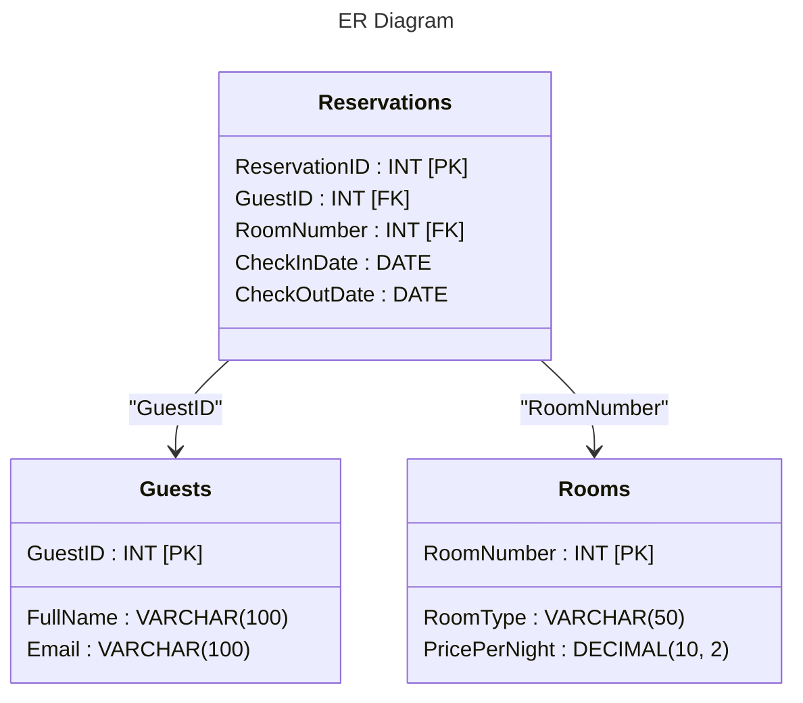

# Rapport: Database management and Optimization

## **Introduction**
This report aims to reflect on the design of the database implemented for a hotel management system. It discusses the decisions made during the design process, evaluates the suitability of the resulting structure, and examines how the solution is optimized under different conditions, such as handling large volumes of data, transaction speed, and complex query requirements.

## Requirements
- Downloads MariaDB Server Rolling : [Link](https://mariadb.org/download/?t=mariadb&p=mariadb&r=11.6.2&os=windows&cpu=x86_64&pkg=msi&mirror=one)


## **Part 1: Database Design and Implementation**
### **1. Schema model**
The Schema model shows the creation of the tables in the database:
- **Guests**: The information about guests.
- **Reservations**: Reservation details that show the guests reservations.


```sql
CREATE DATABASE HotelManagement;
USE HotelManagement;

CREATE TABLE Guests (
GuestID INT PRIMARY KEY,
FullName VARCHAR(100),
Email VARCHAR(100)
);

CREATE TABLE Reservations (
ReservationID INT PRIMARY KEY,
GuestID INT,
CheckInDate DATE,
CheckOutDate DATE,
RoomNumber INT,
FOREIGN KEY (GuestID) REFERENCES Guests(GuestID)
);
```
### **2. Development and Design**
Here we extend the main schema and add another database with its relationship to custom data sets for all tables.

```sql
CREATE TABLE Rooms (
    RoomNumber INT PRIMARY KEY,
    RoomType VARCHAR(50),
    PricePerNight DECIMAL(10, 2)
);

-- Add new Relations with the new table if you dont use the script migrations.sql
ALTER TABLE Reservations
ADD CONSTRAINT fk_room
FOREIGN KEY (RoomNumber) REFERENCES Rooms(RoomNumber);
```

#### Now we need to fill the database with mock data
```sql
-- Data for the Guests table
INSERT INTO Guests (GuestID, FullName, Email) VALUES
(1, 'Alice Johnson', 'alice@example.com'),
(2, 'Bob Smith', 'bob@example.com'),
(3, 'Charlie Brown', 'charlie@example.com'),
(4, 'Diana Prince', 'diana@example.com'),
(5, 'Evan Peters', 'evan@example.com'),
(6, 'Fiona Green', 'fiona@example.com'),
(7, 'George White', 'george@example.com'),
(8, 'Hannah Black', 'hannah@example.com'),
(9, 'Isaac Newton', 'isaac@example.com'),
(10, 'Julia Roberts', 'julia@example.com');


-- Data for the Rooms table
INSERT INTO Rooms (RoomNumber, RoomType, PricePerNight) VALUES
(101, 'Single', 100.00),
(102, 'Double', 150.00),
(103, 'Suite', 300.00),
(104, 'Single', 120.00),
(105, 'Double', 160.00),
(106, 'Suite', 350.00),
(107, 'Single', 110.00),
(108, 'Double', 170.00),
(109, 'Suite', 400.00),
(110, 'Single', 90.00);


-- Data for the Reservations table
INSERT INTO Reservations (ReservationID, GuestID, CheckInDate, CheckOutDate, RoomNumber) VALUES
(1, 1, '2024-12-01', '2024-12-05', 101),
(2, 2, '2024-12-10', '2024-12-15', 102),
(3, 3, '2024-12-20', '2024-12-25', 103),
(4, 4, '2024-12-05', '2024-12-08', 104),
(5, 5, '2024-12-15', '2024-12-18', 105),
(6, 6, '2024-12-18', '2024-12-22', 106),
(7, 7, '2024-12-01', '2024-12-03', 107),
(8, 8, '2024-12-05', '2024-12-09', 108),
(9, 9, '2024-12-25', '2024-12-30', 109),
(10, 10, '2024-12-20', '2024-12-23', 110);
```
### **3. Normalization and Visualization**
The ER diagram shows the relationships between the tables in the database:


### **4. SQL Scripts and Usability**
### (OBS) In the **migrations.sql** file you can find the complete script to create the database and fill it with fake data to be able to use it.

#### Querys to check that the database is working perfectly
```sql
-- Get all querys
SELECT * FROM Reservations;
SELECT * FROM Guests;

-- Order The Data
SELECT * FROM Rooms ORDER BY PricePerNight ASC;

-- BETWEEN a Range
SELECT * FROM Rooms WHERE PricePerNight BETWEEN 150 AND 300;

-- Get the reservation of the user
SELECT Fullname, Email, RoomNumber 
FROM Reservations 
INNER JOIN Guests ON Reservations.GuestID=Guests.GuestID 
WHERE Guests.GuestID = 2;

-- Get the reservation of the user
SELECT CONCAT("Name: ", FullName, " ", " Room: ", RoomNumber, " Check In: ", CheckInDate, " Check Out: ", CheckOutDate) 
AS Reservation 
FROM Reservations 
INNER JOIN Guests ON Reservations.GuestID=Guests.GuestID;
```


## **Part 2: Database Design**
Develop a stored procedure for your database. It should perform a useful function related to your data model.
```

```

## **Part 3: Performance analysis**
In this part we analyze the performance of one of the SQL queries, use a tool like a query planner for analysis and implement an improvement based on the analysis.

### Analyze the performance of one of your SQL queries.
```sql
EXPLAIN SELECT CONCAT("|Name: ", FullName, " ", "| Room: ", RoomNumber, "| Check In: ", CheckInDate, " Check Out: ", CheckOutDate) 
AS Reservation
FROM Reservations 
INNER JOIN Guests 
ON Reservations.GuestID=Guests.GuestID;
```

### OUTPUT
| id | select_type |      table    |  type  |  possible_keys   |   key    |  key_len  |   ref                         |  rows |     Extra    |
|----|-------------|---------------|--------|------------------|----------|-----------|-------------------------------|-------|--------------|
|  1 |    SIMPLE   | Reservations  |  ALL   |     GuestID      | `<NULL>` |  `<NULL>` |        `<NULL>`               |   10  | Using where  |
|  1 |    SIMPLE   |    Guests     | eq_red |     PRIMARY      | PRIMARY  |     4     |  hoteldb.Reservations.GuestID |   1   |              |

### Explain
- Reservations table is doing an "ALL" scan this indicates that the Reservations table is not using an index to filter or join with the Guests table. This can be inefficient if the table has many rows.

### Implement an improvement based on your analysis.
```sql
CREATE INDEX idx_GuestID ON Reservations (GuestID);
CREATE INDEX idx_GuestID ON Guests (GuestID);
CREATE INDEX idx_RoomNumber ON Reservations (RoomNumber);
CREATE INDEX idx_RoomNumber ON Rooms (RoomNumber);
```

## **Part 4: Användarhantering och Säkerhet**
A restricted user was created with specific rights

### Create a new user in the database with limited permissions.
```sql
CREATE USER 'limited_user'@'localhost' IDENTIFIED BY 'p';
GRANT SELECT ON HotelDB.Guests TO 'limited_user'@'localhost';
GRANT SELECT ON HotelDB.Reservations TO 'limited_user'@'localhost';
```
### It is recommended to open a console and try to log in with the new user and try the commands.

```
mysql -u limited_user -p -h localhost
-- the password is p
```
### This is the error that would occur if the user does not have authorization.
```
ERROR 1142 (42000): SELECT command denied to user 'limited_user'@'localhost' for table `hoteldb`.`rooms`
```

### Create a backup of your database.
```sql
BACKUP DATABASE HotelDB TO DISK = 'C:\Users\alexx\Desktop\d-ingupg-d4-Alexx6MR\backup.sql';
```
### Simulate a database crash and show how to restore the database from the backup.
```sql
DROP DATABASE HotelDB;
CREATE DATABASE HotelDB;
mysql -u root -p HotelDB < backup.sql
```